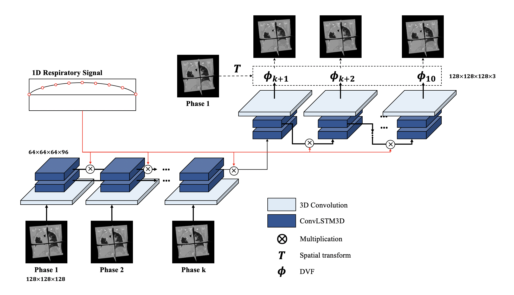

<!-- PROJECT LOGO -->
<br />
<p align="center">
    <h1 align="center"><strong>RMSim: Controlled Respiratory Motion Simulation on Static Patient Scans</strong></h1>
    <p align="center">
    <a href="https://doi.org/10.1088/1361-6560/acb484">Read Link</a> |
    <a href="https://arxiv.org/pdf/2301.11422.pdf">Preprint</a> |
    <a href="https://youtu.be/xIx8B_Q_R9o">Supplementary Video</a> |
    <a href="#usage">Usage</a> |
    <a href="https://github.com/nadeemlab/SeqX2Y/issues">Report Bugs/Errors</a>
  </p>
</p>

A pytorch implementation of the paper [RMSim: Controlled Respiratory Motion Simulation on Static Patient Scans](https://doi.org/10.1088/1361-6560/acb484) by Donghoon Lee, Ellen Yorke, Masoud Zarepisheh, Saad Nadeem, and Yuchi Hu.
In this repository, we provide the code for the proposed RMSim model and the pretrained model. 
We implemented the train logic from the original paper, and the test logic for the LUNA and 4DCT Dicom dataset.

In training logic, we reimplement the loss function with MSE loss and cross entropy loss, and we use the 4DCT dataset to train the model, and in testing, we use the LUNA dataset to test the model.

## Abstract
A novel 3D Seq2Seq deep learning respiratory motion simulator (RMSim) that learns from 4D-CT images and predicts future breathing phases given
a static CT image. The predicted respiratory patterns, represented by time-varying displacement vector fields (DVFs) at different breathing phases, are modulated through
auxiliary inputs of 1D breathing traces so that a larger amplitude in the trace results in more significant predicted deformation. Stacked 3D-ConvLSTMs are used to capture
the spatial-temporal respiration patterns. A spatial transformer deforms the static CT with the predicted DVF to generate the predicted phase image. 10-phase 4D-CTs were used to train RMSim. 

*The schematic image for the proposed deep learning model. The Seq2Seq encoder-decoder framework was used as the backbone of the proposed model.  The model was built with 3D convolution layers {for feature encoding and output decoding} and 3D convolutional Long Short-Term Memory (3D ConvLSTM) layers (for spatial-temporal correlation between time points). The last layer of the decoder was a spatial transform layer to warp the initial phase image with the predicted Deformation Vector Field (DVF). To modulate the respiratory motions the 1D breathing trace was given as input along with the initial phase image. The dimension of image volume was 128 x 128 x 128 and the input feature to 3D ConvLSTM is 64 x 64 x 64 x 96 (Depth x Width x Height x Channel)}.*

## Usage

1. git clone the project to your local machine.

``` bash
git clone https://github.com/ChenKaiXuSan/SeqX2Y_PyTorch.git
```

2. make the run time environment, here we recommend you to use the docker to run the code, you can find the dockerfile in the docker folder.

3. change the directory to the project folder.

``` bash
cd  SeqX2Y_PyTorch/
```

4. run the code.

``` bash  
python project/main.py
```

have a cup of coffee and wait for the result.

`
A pretrained model as well as a set of 20 breathing traces and LUNA public CT dataset can be downloaded [here](https://zenodo.org/record/7730879). Once the data is downloaded, unpack the **pretrained_model.zip** into the **trained_model** folder and unpack **LUNA_imaging.zip** and **LUNA_mask.zip** into the **public_data** folder. Finally, test code can be run using the **test_LUNA.py** script to generate 10 phases, DVF, and the deformed masks. The resuts will be generated in the results folder. The final results from the test run can also be found [here](https://zenodo.org/record/7730879). 
`


## Folde Tree 
``` bash
.
|-- configs
|   `-- data
|-- images
|-- logs
|-- project
|   `-- models
`-- test
    |-- bak
    `-- public_data

```

## Dataset 

For datset, we use the popi open source dataset, you can download from [here](https://continuousregistration.grand-challenge.org/data/).

This dataset include different patient's 4d CT medical image, in .dcm format.
For one patient, it includ 10 different breatch type in one cycling, and one cycling include 140 dicom images.
<!-- 
## logs

2023-08-11
- optimize the code 
  - mkdir ./test to store the test results and file.
  - try sitk to load the medical from .dicm and .nrrd.
  - config the hydra, you can use ./configs/config.yaml to confige your parmeters.
  - add pip commedn to ./requirements.txt
  - complete loss function (smoothl1loss+MSEloss) -->

## Reference
If you find this work useful in your research or if you use parts of this code, please cite the original paper:
```
@article{lee2023rmsim,
  title={RMSim: controlled respiratory motion simulation on static patient scans},
  author={Lee, Donghoon and Yorke, Ellen and Zarepisheh, Masoud and Nadeem, Saad and Hu, Yuchi},
  journal={Physics in Medicine and Biology},
  volume={68},
  issue={4},
  pages={045009}
}
```